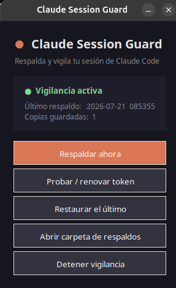

<p align="center">
  
</p>

<h1 align="center">Claude Session Guard</h1>

<p align="center"><b>Your Claude Code session — backed up, watched, and kept alive.</b><br>
Never get logged out on a new machine again. &nbsp;·&nbsp; Linux · macOS · Windows</p>

<p align="center">
  <a href="https://github.com/DiegoFernandoLojanTenesaca/claude-session-guard/actions/workflows/ci.yml"></a>
  
  
  
</p>

---

Every time you open Claude Code it rotates the OAuth token in your home folder.
If that token gets cleared, lost, or **quietly expires after a few idle days**,
you're logged out — annoying on your main box, blocking on a fresh one.
Claude Session Guard keeps a rolling backup of your session and keeps the token
from dying, so you can walk up to any machine and be back **in seconds**.

## Ever had this happen?

- 🔄 **New laptop** and getting back into Claude is a chore — re-auth, browser, the works.
- 💥 **Lost or broke** your machine and your session went with it.
- ✈️ **Traveling** and you need your session on another computer.
- ⏳ Didn't open Claude for a **few days** and the token **expired on its own**.

## What it does

- ☁️ **Snapshots** your credentials + config every time the token changes, so you always keep the freshest *valid* one.
- 🛡 **Guards** the token — if it empties or disappears it notifies you (and can auto-restore the last good copy). It **never** overwrites a good backup with a broken one.
- ⚡ **Keeps it alive** — the `refreshToken` only renews when Claude *starts*, so after idle days it can expire. Guard runs `claude -p` headless to renew it (and double-check it still works). No SDK, no API key — it drives the real CLI, so it refreshes the *actual* OAuth session.

## How it works, in 10 seconds

1. **Install once** on the machine where you use Claude.
2. **Forget about it** — it backs up on every token change and keeps the last 50.
3. **New machine?** Copy your `~/claude-backups/` over, run `restore`, restart Claude. You're in.

## Install

| System | Command |
|---|---|
| **Linux / macOS** | `./install.sh` &nbsp;(or `python3 install.py`) |
| **Windows** | double-click **`install.bat`** |

That's the whole setup. After it runs, everything is **automatic**: the watcher
**starts on every login** and backs up in the background — you never have to run
anything again. It also drops a **Claude Session Guard** app (with icon) in your
menu for a one-click dashboard.

> Requirements: **Python 3.8+** (bundled with the app's launcher). The GUI needs
> **Tk** (bundled on Windows/macOS; `sudo apt install python3-tk` on Linux). The
> keepalive needs the **`claude` CLI** on your `PATH`. No `pip install`, ever.

## The app

<p align="center">
  
</p>

A tiny dark window: watcher status, last backup, snapshot count, backup folder,
and one-click actions — **Back up now** · **Test / renew token** ·
**Restore latest** · **Open backups folder** · **Change backup folder…** ·
**Start/Stop watcher**. Pick a Drive/USB folder right from the app — no env
vars needed.

Prefer the terminal?

```bash
python3 guard.py               # GUI
python3 guard.py backup        # snapshot now
python3 guard.py restore       # restore latest (e.g. on a new PC)
python3 guard.py restore --creds-only   # only the token — leaves .claude.json untouched
python3 guard.py keepalive     # renew + test the token now
python3 guard.py watch 60      # foreground watcher
```

> **Restore is reversible.** Before overwriting, it saves your current state to
> `~/claude-backups/_restore_undo/<timestamp>/`. Undo with `restore <that dir>`.
> Restoring on the **same** machine? Use `--creds-only` so it only brings the
> token back and leaves your current `~/.claude.json` (projects, MCP) alone.

## Log in on another machine

Your session lives in `~/claude-backups/`. Get that folder onto the other
computer (USB, Google Drive, `scp`, or point `CLAUDE_BACKUP_DIR` at a synced
folder from the start), then:

**A) A machine that never had Claude Code**
1. Install Claude Code — see the [official docs](https://docs.claude.com/en/docs/claude-code/overview). *(You don't need to log in.)*
2. Get this repo there (`git clone` or copy) and drop your `~/claude-backups/` next to your home.
3. Run `python3 guard.py restore`.
4. Start Claude Code — you're already signed in. No browser, no code.

**B) A machine that has Claude but the session closed / expired**
1. Make sure `~/claude-backups/` is present (or synced).
2. `python3 guard.py restore`
3. Restart Claude Code. Done.

> **The date is dropped on restore, automatically.** Backups are stored dated
> (`2026-07-21_085355_.credentials.json`) but `restore` writes them back to
> their real names — `~/.claude/.credentials.json`, `~/.claude/.last-cleanup`,
> `~/.claude.json` — which is what Claude actually reads. You don't rename anything.

## Options (environment variables)

| Variable | Default | What |
|---|---|---|
| `CLAUDE_BACKUP_DIR` | `~/claude-backups` | back up to an external drive / synced folder |
| `RESTORE_ON_LOSS` | `0` | auto-restore the last good copy if the token vanishes |
| `KEEP` | `50` | how many snapshots to keep |
| `REFRESH_EVERY` | `172800` | seconds of inactivity before a keepalive runs (2 days) |
| `KEEPALIVE_MODEL` | `haiku` | model used for the keepalive ping (cheapest) |
| `CLAUDE_BIN` | auto | override the Claude CLI location |
| `CLAUDE_BACKUP_PASSPHRASE` | — | if set, every snapshot is **encrypted** (see below) |

## Security

Backups contain your OAuth tokens — treat them like the key to your account. The
tool keeps the backup dir `700` and files `600`. If you point `CLAUDE_BACKUP_DIR`
at a cloud-synced folder, your tokens go to that cloud — your call.

**Optional encryption.** Set `CLAUDE_BACKUP_PASSPHRASE` and every snapshot is
encrypted with `openssl` (AES-256-CBC, PBKDF2) — safe to sync to Drive/Dropbox.
Restore needs the same passphrase; without it, an encrypted backup won't restore.
Requires the `openssl` CLI (standard on Linux/macOS; on Windows it ships with
Git for Windows). The passphrase is passed to openssl via the environment, never
on the command line.

<details>
<summary><b>Technical details</b> (for the curious)</summary>

**Files backed up** → `~/claude-backups/YYYY-MM-DD_HHMMSS/` (last `KEEP` kept):

| File | What |
|------|------|
| `~/.claude/.credentials.json` | OAuth token (the important one) |
| `~/.claude/.last-cleanup` | cleanup marker |
| `~/.claude.json` | projects / MCP config |

- **Token validity** is checked by reading `claudeAiOauth.accessToken` from the
  JSON before every snapshot — that's why it never clobbers a good copy with a
  broken/empty one (unlike a plain file-watcher, inotify hook, or cron job).
- **Watcher** is a 60s poll loop, single-instance via an atomic PID-file
  (`O_EXCL`). Autostart is systemd-less: **XDG autostart** on Linux,
  **LaunchAgent** on macOS, **Startup folder** (`pythonw`, no console) on Windows.
- **Keepalive** fires only after `REFRESH_EVERY` of real inactivity; a normal
  Claude session resets the timer. Uses the cheapest model and a one-word prompt.
- **Notifications**: `notify-send` (Linux), `osascript` (macOS), a PowerShell
  balloon (Windows). Everything is also appended to `~/claude-backups/guard.log`.
- **Credential storage** (per Claude Code docs): a file on **Linux**
  (`~/.claude/.credentials.json`) and **Windows**
  (`%USERPROFILE%\.claude\.credentials.json`), and the **login Keychain** on
  **macOS**. `CLAUDE_CONFIG_DIR` relocates it, and Guard honors that too.
- **macOS**: the token is in the Keychain, but Claude reads
  `~/.claude/.credentials.json` as a fallback when present. So **restore works**
  (Guard writes that file) and **backup** pulls the token from the Keychain via
  `security find-generic-password -s "Claude Code-credentials"`.
- **Backup destination** comes from `CLAUDE_BACKUP_DIR`, else the folder picked
  in the app (saved to `~/.config/claude-session-guard/config.json`), else
  `~/claude-backups`.
- *Windows and macOS run the same code as Linux but haven't been tested on real
  hardware yet — reports welcome.*
- Pure Python stdlib: `guard.py` (engine + CLI + GUI), `install.py` / `uninstall.py`.

</details>

## Uninstall

```bash
python3 uninstall.py   # keeps your backups
```

## Credits

Built by [@DiegoFernandoLojanTenesaca](https://github.com/DiegoFernandoLojanTenesaca).
The keepalive idea — and the nudge to build this — came from
[@jahirxtrap](https://github.com/jahirxtrap), author of
[**cconnect**](https://github.com/jahirxtrap/cconnect), a mobile / desktop / web
client for Claude Code.

## License

MIT
